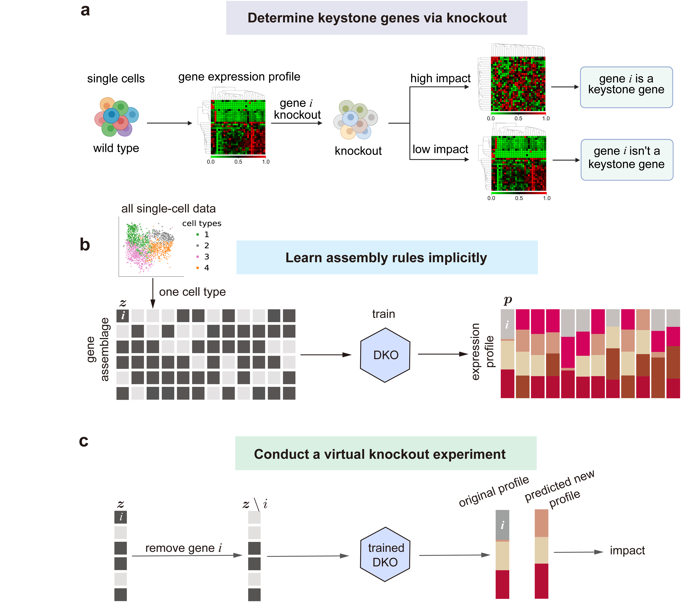

# DKO (Data-driven KnockOut for identifying high impact genes)

This is a Pytorch implementation of DKO, as described in our manuscript:

Yongjian He, Vered Klein, Orr Levy, Xu-Wen Wang, [Predicting single-cell knockout responses from unperturbed transcriptomes through deep learning] (arXiv https://arxiv.org/abs/2510.03359). 

  

The code is tested in python environment: environment-history.yml

## Contents

- [Overview](#overview)
- [Data type for DKO](#Data-type-for-DKO)
- [How the use the DKO framework](#How-the-use-the-DKO-framework)

# Overview

We present a data-driven framework for identifying high-impact genes and predicting transcriptional outcomes of single and multi-gene knockouts. It bypasses reconstruction of detailed gene-to-gene interactions by learning mappings between gene assemblages and expression profiles directly from natural single-cell RNA-seq data. The approach requires no prior biological knowledge or perturbed training datasets. Across synthetic benchmarks, CRISPRi Perturb-seq, and mouse knockout atlases, it accurately predicts expression changes and outperforms existing methods in single-gene/two-gene perturbation effects prediction at single-cell resolution, enabling genome-scale inference of gene function beyond experimental perturbation screens.

# Data type for DKO
## 1. Ptrain.csv: DKO input expression matrix
DKO only requires a gene expression matrix as input. Ptrain.csv is an N × M single-cell expression matrix (no header), where N is the number of genes and M is the number of cells.

|           | cell 1 | cell 2 | cell 3 | 
|-----------|----------|----------|----------|
| gene 1 | 0.15     | 0.35     | 0.56     | 
| gene 2 | 0.25     | 0.1      | 0        | 
| gene 3 | 0        | 0.35     | 0.1        | 
| gene 4 | 0.3      | 0        | 0.14     |
| gene 5 | 0.3      | 0.2        | 0.2     |

## 2. Virtual single-gene KO experiment
Thought experiemt was realized by removing single present gene in cell samples. This will generated three data type.

- **Ptest.csv**: perturbation matrix of size `N × C`, where `N` is the number of genes (rows) and `C` is the number of perturbed cells / KO events (columns). Each column represents a single-gene KO in a specific cell.

|           | perturb cell 1 | perturb cell 2 | perturb cell 3 | perturb cell 4 | ... | perturb cell C |
|-----------|----------|----------|----------|----------|----------|----------|
| gene 1 | 0        | 0.15        | 0.35     | 0.35        | ...     | 0.56     |
| gene 2 | 0.25     | 0           | 0.0     | 0.1      |...       | 0      | 
| gene 3 | 0        | 0           | 0        | 0.35     | ...     | 0.1        | 
| gene 4 | 0.3      | 0.3         | 0.35        | 0        | ...       | 0        | 
| gene 5 | 0.3      | 0.3         | 0.2        | 0        | ...        | 0.2        |

- **Ztest.csv**: Ztest file is a binarized version of Ptest (same shape). For each entry, Ztest = 1 if the corresponding gene is expressed/present in Ptest (i.e., expression > 0), and Ztest = 0 otherwise.

|           | perturb cell 1 | perturb cell 2 | perturb cell 3 | perturb cell 4 | ... | perturb cell C |
|-----------|----------|----------|----------|----------|----------|----------|
| gene 1 | 0        | 1        | 1     | 1        | ...     | 1     |
| gene 2 | 1     | 0           | 0     | 1      |...       | 0      | 
| gene 3 | 0        | 0           | 0        | 1     | ...     | 1        | 
| gene 4 | 1      | 1         | 1        | 0        | ...       | 0        | 
| gene 5 | 1      | 1         | 1        | 0        | ...        | 1        |

- **Recorder.csv**: A `C × 2` table records single-gene KO events. Each row `[gene_id, cell_id]` records that the gene_id is knocked out in that cell_id.

|gene_id           | cell_id |
|-----------|----------|
| 1 | 1     | 
| 2 | 1     | 
| 2 | 2     | 
| 5 | 2     | 
| ... | ...     | 
| 4 | 3     | 

## 3. Virtual double-gene KO experiment
A virtual double-gene KO experiment is constructed by knocking out two present genes in the same cell (i.e., setting both genes to zero for that cell profile). This generates:

- **Ptest_doubleKO.csv**: perturbation matrix of size `N × C`, where `N` is the number of genes (rows) and `C` is the number of perturbed cells / KO events (columns). Each column represents a two-gene KO in a specific cell.

|           | perturb cell 1 | perturb cell 2 | perturb cell 3 | perturb cell 4 | ... | perturb cell C |
|-----------|----------|----------|----------|----------|----------|----------|
| gene 1    | 0        | 0         | 0.45     | 0.35        | ...     | 0.15     |
| gene 2    | 0        | 0         | 0.25     | 0      | ...       | 0.25      |
| gene 3    | 0        | 0.35      | 0        | 0     | ...     | 0        |
| gene 4    | 0.3      | 0         | 0        | 0        | ...        | 0        | 
| gene 5    | 0.3      | 0.2       | 0        | 0.2        | ...        | 0        |

- **Ztest_doubleKO.csv**: Ztest_doubleKO is a binarized version of Ptest_doubleKO (same shape).For each entry, Ztest_doubleKO = 1 if the corresponding gene is expressed/present in Ptest_doubleKO (i.e., expression > 0), and Ztest = 0 otherwise.

|           | perturb cell 1 | perturb cell 2 | perturb cell 3 | perturb cell 4 | ... | perturb cell C |
|-----------|----------|----------|----------|----------|----------|----------|
| gene 1    | 0        | 0         | 1     | 1        | ...     | 1     |
| gene 2    | 0        | 0         | 1     | 0      | ...       | 1      |
| gene 3    | 0        | 1      | 0        | 0     | ...     | 0        |
| gene 4    | 1      | 0         | 0        | 0        | ...        | 0        | 
| gene 5    | 1      | 1       | 0        | 1        | ...        | 0        |

- **Recorder_doubleKO.csv**: A `C × 3` table records double-gene KO events. Each row `[gene1_id, gene2_id,cell_id]` indicates that the gene pair (gene1_id, gene2_id) is knocked out in that cell_id.

|gene1_id   | gene2_id | cell_id |
|-----------|----------|----------|
| 1 | 2     | 1
| 1 | 2     | 2
| 4 | 1     | 3
| 3 | 2     | 2
| ... | ...     | ...
| 4 | 5     | 1

# How to use the DKO framework
## Step 1: Predict gene expression profile using gene assemblage
Open `Learn_Mapping_and_Predicting_gene_profile.ipynb` and load `Ptrain.csv` as input. The pipeline splits the cells in Ptrain.csv into an 80/20 train–test set (80% training, 20% testing), trains the model on the training set, and outputs predicted gene expression profiles for the held-out 20% test cells.

## Step 2: Single-gene KO impact prediction
Run `Predicting_KO_impact.ipynb` with `Ptrain.csv` as input. The pipeline will:
1. Construct **Ptest** (and **Ztest**) and a **Recorder** matrix from `Ptrain.csv`.
2. Train the model on **Ptrain.csv**.  
3. Apply the trained model to **Ztest** to predict the post-KO profiles.
4. Computing gene KO impact by comparing the profile befor and after KO
5. **Outputs:** **KO impact scores** for each `(gene, cell)` pair.

The output file:
|gene_id   | cell_id | impact score |
|-----------|----------|----------|
| 1 | 1     | 0.044832664|
| 2 | 1     | 0.061767839
| 4 | 1     | 0.039787205
| 1 | 2     | 0.032485329
| 2 | 2     | 0.049242764
| 3 | 2     | 0.046929884
| 1 | 3     | 0.036644731
| 3 | 3     | 0.059429204
| 4 | 3     | 0.017946411

Each row reports the predicted KO impact score of gene_id in cell_id.

By default, **Ptest** and **Recorder** files enumerate perturbations across the entire input matrix (i.e., applying KO perturbations to all expressed genes across all cells). You may also use your own single-cell expression matrix as `Ptrain.csv`. Depending on your needs, you can optionally construct **Ptest** and **Recorder** for a selected subset of genes/cells and run KO prediction only on those perturbations.

## Step 3: Double-gene KO impact prediction
Similarity to Step2, Run `Predicting_double_gene_KO_impact.ipynb` with `Ptrain.csv` as input. The workflow is the same as Step 2, except that each perturbation knocks out two genes. The output is a KO impact score for each (gene1_id, gene2_id, cell_id) triple.
For example：
| gene1_id | gene2_id | cell_id | k_pred   |
|---------:|---------:|--------:|---------:|
| 1        | 2       | 1     | 0.076976 |
| 2        | 3       | 2     | 0.045585 |
| 1       | 4       | 3     | 0.055198 |
| 1       | 3       | 1     | 0.027712 |
| 2       | 3       | 4     | 0.065817 |
| …        | …        | …       | …        |

Each row reports the predicted KO impact score of the gene pair (gene1_id, gene2_id) in cell_id.

